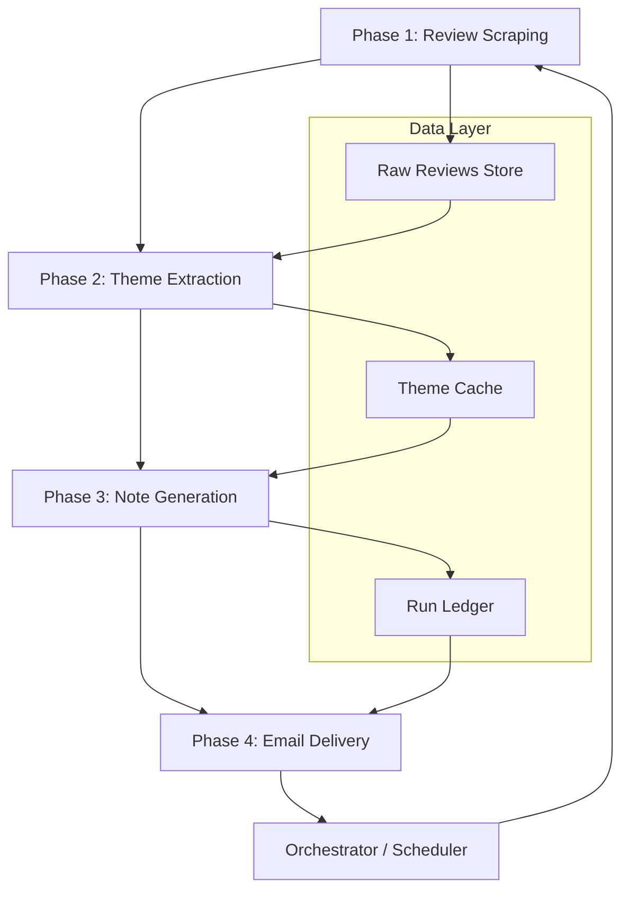

# Architecture: Automated App Review Intelligence Pipeline

## System Overview

An end-to-end automated pipeline that scrapes public App Store and Play Store reviews weekly, extracts actionable themes using **Groq API** (LLaMA models), generates a concise weekly intelligence note, and delivers it via **Gmail MCP** (Model Context Protocol) — fully autonomous, idempotent, and PII-safe.

---



---

## Phase 1 — Review Scraping

### Purpose
Collect raw user reviews from the Apple App Store (iTunes RSS feed) and Google Play Store (public endpoints) for the last 8–12 weeks. No authentication, no API keys, no login walls.

### Architecture

```
┌─────────────────────────────────────────────────┐
│              ScraperOrchestrator                 │
│  ┌──────────────────┐  ┌──────────────────────┐ │
│  │ AppleRSSScraper   │  │ GooglePlayScraper    │ │
│  │                   │  │                      │ │
│  │ - iTunes RSS Feed │  │ - Public web endpoint│ │
│  │ - JSON parsing    │  │ - HTML parsing       │ │
│  │ - Pagination      │  │ - Pagination tokens  │ │
│  └────────┬──────────┘  └──────────┬───────────┘ │
│           │                        │              │
│           └────────┬───────────────┘              │
│                    ▼                              │
│           ReviewNormalizer                        │
│           - Unified schema                       │
│           - Deduplication (review_id)             │
│           - Date filtering (8–12 weeks)           │
│           - Language detection tag                │
│                    │                              │
│                    ▼                              │
│           raw_reviews.jsonl                       │
└─────────────────────────────────────────────────┘
```

### Data Schema — Normalized Review

```json
{
  "review_id": "string (platform-specific unique ID)",
  "platform": "apple | google",
  "author_anonymous_hash": "string (SHA-256 of author name, never stored raw)",
  "rating": 1-5,
  "title": "string | null",
  "body": "string",
  "date": "ISO 8601 date",
  "language": "ISO 639-1 code (detected)",
  "app_version": "string | null",
  "scraped_at": "ISO 8601 timestamp"
}
```

### Key Design Decisions

| Decision | Rationale |
|---|---|
| iTunes RSS feed (JSON) over web scraping | Stable public endpoint, structured JSON, no auth required |
| Google Play HTML parsing with `google-play-scraper` npm lib or equivalent Python library | No official public API; community libraries handle pagination and rate limits |
| JSONL storage (one review per line) | Append-friendly, streaming-friendly, easy to debug |
| SHA-256 hashing of author names | PII compliance — never store raw usernames |
| Language detection via `langdetect` | Tag non-English reviews so LLM can handle or skip gracefully |
| Dedup by `review_id` | Prevent duplicate reviews across runs |

### Configuration

```yaml
scraper:
  apple:
    app_id: "com.example.app"
    country: "us"
    rss_limit: 15000           # max per RSS fetch
  google:
    app_id: "com.example.app"
    language: "en"
    count: 15000
  lookback_weeks: 12
  min_lookback_weeks: 8
  rate_limit:
    requests_per_minute: 10
    retry_max: 3
    retry_backoff_seconds: 5
```

### Error Handling

- **Rate limiting**: Exponential backoff with jitter, max 3 retries
- **Empty feed**: Log warning, proceed with empty dataset (handled in Phase 2)
- **Malformed response**: Skip individual review, log error, continue
- **Network timeout**: 30-second timeout per request, retry with backoff
- **Partial failure**: If one platform fails, proceed with the other; flag in output metadata

---

## Phase 2 — Theme Extraction (LLM)

### Purpose
Group all collected reviews into a maximum of 5 specific, product-relevant themes using an LLM. Themes must be feature-specific (e.g., "KYC verification flow"), not vague (e.g., "bad experience").

### Architecture

```
┌──────────────────────────────────────────────────────────┐
│                    ThemeExtractor                         │
│                                                          │
│  ┌──────────────┐   ┌──────────────┐   ┌──────────────┐ │
│  │ ReviewLoader  │──▶│ Preprocessor │──▶│ LLMThemer    │ │
│  │               │   │              │   │              │ │
│  │ - Load JSONL  │   │ - Filter by  │   │ - Batch      │ │
│  │ - Date filter │   │   date range │   │   reviews    │ │
│  │               │   │ - Remove     │   │ - Prompt     │ │
│  │               │   │   duplicates │   │   engineering│ │
│  │               │   │ - Strip PII  │   │ - Max 5      │ │
│  │               │   │   (regex)    │   │   themes     │ │
│  └──────────────┘   └──────────────┘   └──────┬───────┘ │
│                                                │         │
│                                                ▼         │
│                                       ThemeValidator     │
│                                       - Schema check     │
│                                       - Theme count ≤ 5  │
│                                       - Specificity      │
│                                         scoring          │
│                                                │         │
│                                                ▼         │
│                                        themes.json       │
└──────────────────────────────────────────────────────────┘
```

### LLM Prompt Strategy

**Two-step extraction with chain-of-thought:**

**Step 1 — Theme Discovery Prompt:**
```
You are an expert product analyst. Given the following app reviews, identify
up to 5 specific themes. Each theme must:
- Reference a concrete product feature, screen, or flow (e.g., "KYC document
  upload timeout", NOT "bad experience")
- Be distinct from other themes (no overlapping categories)
- Be supported by at least 2 reviews

Reviews:
{batched_reviews}

Respond in JSON:
{
  "themes": [
    {
      "theme_name": "string",
      "description": "one-line description",
      "review_ids": ["id1", "id2", ...],
      "sentiment": "negative | positive | mixed",
      "volume": <count>
    }
  ]
}
```

**Step 2 — Theme Consolidation Prompt (if batching required):**
```
You are merging theme lists from multiple batches. Consolidate into a final
list of at most 5 themes. Merge similar themes. Preserve review_id mappings.
Keep the most specific theme name. Output the same JSON schema.
```

### Batching Strategy

| Review Count | Strategy |
|---|---|
| ≤ 50 | Single LLM call |
| 51–200 | 2–4 batches of ~50, then consolidation call |
| 201–500 | 5–10 batches, hierarchical merge (batch → merge pairs → final) |
| > 500 | Sample 500 most recent, flag in metadata |

### Data Schema — Theme Output

```json
{
  "run_date": "ISO 8601",
  "review_window": { "start": "date", "end": "date" },
  "total_reviews_analyzed": 247,
  "themes": [
    {
      "theme_id": "theme_001",
      "theme_name": "KYC verification flow failures",
      "description": "Users report documents being rejected or upload timing out during identity verification",
      "sentiment": "negative",
      "volume": 42,
      "review_ids": ["r_001", "r_005", "..."],
      "representative_quotes": [
        {
          "review_id": "r_005",
          "quote": "Tried uploading my PAN card 3 times, keeps showing error",
          "rating": 1
        }
      ]
    }
  ],
  "metadata": {
    "llm_provider": "groq",
    "llm_model": "llama-3.1-70b-versatile",
    "batches_used": 3,
    "tokens_consumed": 12450,
    "non_english_reviews_skipped": 8
  }
}
```

### Key Design Decisions

| Decision | Rationale |
|---|---|
| Two-step (discover + consolidate) | Handles large review volumes without hitting token limits |
| Specificity scoring in validator | Rejects vague themes like "general complaints"; re-prompts if needed |
| Max 5 themes hard cap | Problem constraint; enforced in prompt AND in post-processing |
| Quote selection by LLM | LLM picks the most representative quote; validator strips any remaining PII via regex |
| Model: Groq `llama-3.1-70b-versatile` | Groq provides ultra-fast inference (~10x faster than OpenAI); LLaMA 3.1 70B is strong at structured JSON output and classification. Fallback to `llama-3.1-8b-instant` for cost savings or `llama-3.3-70b-versatile` for improved quality |

### PII Scrubbing (Defense in Depth)

```
Pipeline: Raw review → Regex PII strip → LLM processing → Output PII check
Patterns: email, phone, device IDs, @usernames, Aadhaar-like numbers
Action: Replace with [REDACTED], log occurrence count
```

---

## Phase 3 — Weekly Note Generation

### Purpose
Generate a single, scannable weekly intelligence note under 250 words containing the top 3 themes by volume, one real user quote per theme, and three actionable feature-specific recommendations.

### Architecture

```
┌────────────────────────────────────────────────────────────┐
│                    NoteGenerator                           │
│                                                            │
│  ┌──────────────┐   ┌────────────────┐   ┌──────────────┐ │
│  │ ThemeRanker   │──▶│ NoteComposer   │──▶│ NoteValidator│ │
│  │               │   │ (LLM)          │   │              │ │
│  │ - Sort by     │   │                │   │ - Word count │ │
│  │   volume      │   │ - Top 3 themes │   │   ≤ 250      │ │
│  │ - Select      │   │ - 1 quote each │   │ - PII check  │ │
│  │   top 3       │   │ - 3 action     │   │ - Theme count│ │
│  │ - Pick best   │   │   ideas        │   │   = 3        │ │
│  │   quote each  │   │ - Feature-     │   │ - Actions    │ │
│  │               │   │   specific     │   │   reference  │ │
│  │               │   │   actions      │   │   features   │ │
│  └──────────────┘   └────────────────┘   └──────┬───────┘ │
│                                                  │         │
│                                                  ▼         │
│                                           weekly_note.md   │
│                                           weekly_note.html │
└────────────────────────────────────────────────────────────┘
```

### Note Template (LLM Output Format)

```markdown
# Weekly App Review Pulse — {week_date_range}

**{total_reviews} reviews analyzed** across App Store and Play Store.

## Top Themes This Week

### 1. {Theme Name} ({volume} mentions, {sentiment})
> "{representative_quote}"

### 2. {Theme Name} ({volume} mentions, {sentiment})
> "{representative_quote}"

### 3. {Theme Name} ({volume} mentions, {sentiment})
> "{representative_quote}"

## Suggested Actions
1. **{Screen/Feature}**: {specific action recommendation}
2. **{Screen/Feature}**: {specific action recommendation}
3. **{Screen/Feature}**: {specific action recommendation}

---
_Auto-generated on {timestamp}. Covers reviews from {start_date} to {end_date}._
```

### LLM Prompt for Note Composition

```
You are a product analyst writing a weekly review summary for a product team.

Given these themes (ranked by volume):
{top_3_themes_json}

Write a summary note following these STRICT rules:
1. Include exactly 3 themes, each with: theme name, mention count, sentiment,
   and one verbatim user quote (from the provided quotes only).
2. Include exactly 3 action ideas. Each action MUST name a specific screen,
   feature, or product flow — never say "improve the experience" or similar
   generic advice.
3. Total word count MUST be under 250 words.
4. No usernames, emails, device IDs, or any personal identifiers.
5. Use the markdown template provided.

Output the note as markdown only. No preamble.
```

### Validation Rules

| Rule | Check | Action on Failure |
|---|---|---|
| Word count ≤ 250 | `len(note.split()) <= 250` | Re-prompt with explicit truncation instruction |
| PII-free | Regex scan for emails, phones, IDs | Replace with [REDACTED], re-generate if > 2 hits |
| Exactly 3 themes | Count `###` headers in Themes section | Re-prompt |
| Actions reference features | Each action has a bolded feature/screen | Re-prompt with examples |
| Quotes are verbatim | Cross-check against `representative_quotes` | Replace with original quote |

### Output Formats

- **Markdown** (`weekly_note.md`) — for archiving and version control
- **HTML** (`weekly_note.html`) — for email body rendering (converted from markdown)
- **Plain text** — fallback for email clients that strip HTML

---

## Phase 4 — Email Delivery & Google Docs Integration

### Purpose
Draft/send the weekly note as an email and append it to a Google Doc using a **Remote MCP REST Server** deployed at `https://saksham-mcp-server-a7gq.onrender.com`. By hitting a centralized server, the pipeline avoids local OAuth2 setup, token rotation, and complex Gmail SDK dependencies.

### Why Remote REST endpoints over Local Gmail SDK
| Aspect | Raw/Local SDK | Remote MCP Server (Render) |
|---|---|---|
| Authentication | Complex flow, token refresh, OAuth credentials locally | Managed centrally on the server; zero local auth config |
| Setup complexity | Need `@anthropic/gmail-mcp-server` local installs | Just standard `requests.post()` |
| Portability | Needs sensitive secrets per runner | Safe to run anywhere without handing out Google tokens |

### Architecture

```
┌──────────────────────────────────────────────────────────────────┐
│                    Document & Email Delivery                     │
│                                                                  │
│  ┌──────────────┐  ┌──────────────┐  ┌────────────────────────┐ │
│  │ RunLedger     │  │ Drafter      │  │ Remote MCP Server      │ │
│  │               │  │              │  │ (Render API)           │ │
│  │ - Check if    │  │ - Subject    │  │ - POST /create_email     │ │
│  │   week already│  │   line gen   │  │ - POST /append_doc       │ │
│  │   sent        │  │ - HTML body  │  │                        │ │
│  │               │  │   from note  │  │ (Auth handled offsite) │ │
│  └──────┬───────┘  └──────┬───────┘  └──────────┬─────────────┘ │
│         │                  │                      │               │
│         ▼                  ▼                      ▼               │
│     run_ledger.json    email_draft          Gmail / Doc API       │
└──────────────────────────────────────────────────────────────────┘
```

### REST API Usage

**Creating a Draft:**
```python
import requests

response = requests.post(
    "https://saksham-mcp-server-a7gq.onrender.com/create_email_draft",
    json={
        "to": "product-team@example.com",
        "subject": "Weekly App Review Pulse — Apr 15–21, 2026",
        "body": "<html>...rendered note...</html>"
    }
)
```

**Appending to Google Docs:**
```python
import requests

response = requests.post(
    "https://saksham-mcp-server-a7gq.onrender.com/append_to_doc",
    json={
        "doc_id": "1A2b3C4d5E6f...",
        "content": "...markdown content..."
    }
)
```

### Run Ledger Schema

```json
{
  "runs": [
    {
      "run_id": "uuid",
      "week_key": "2026-W16",
      "run_date": "2026-04-22T14:00:00Z",
      "status": "sent | dry_run | failed",
      "delivery_method": "gmail_mcp",
      "recipients": ["team@example.com"],
      "reviews_analyzed": 247,
      "themes_extracted": 5,
      "note_word_count": 218,
      "gmail_message_id": "string | null",
      "gmail_thread_id": "string | null",
      "error": "string | null"
    }
  ]
}
```

### Duplicate Prevention Logic

```python
def should_send(week_key: str, ledger: dict) -> bool:
    """Check if this week's note has already been sent."""
    for run in ledger["runs"]:
        if run["week_key"] == week_key and run["status"] == "sent":
            return False
    return True
```

### Email Configuration (Environment Variables)

```
# Email settings
EMAIL_TO=product-team@example.com
DOCS_ID=your-google-doc-id-here
```

### Dry-Run Mode

When `dry_run=true` in `pipeline_config.yaml`:
- Full pipeline executes (scrape → themes → note)
- API endpoint calls are skipped or a mock is used.
- Note written to `output/dry_run/{week_key}/`
- Ledger records status as `dry_run`
- Console prints the payload that WOULD have been sent.

---

## Orchestrator / Scheduler

### Purpose
Coordinate all four phases into a single automated weekly run, with logging, error recovery, and status reporting.

### Architecture

```python
# orchestrator.py (simplified)

def run_pipeline(config: PipelineConfig):
    """Execute the full pipeline: scrape → themes → note → email."""
    
    week_key = get_current_week_key()  # e.g., "2026-W17"
    
    # Phase 1: Scrape
    reviews = scrape_reviews(config.scraper)
    save_reviews(reviews, f"data/raw/{week_key}.jsonl")
    
    # Phase 2: Extract themes
    themes = extract_themes(reviews, config.llm)
    save_themes(themes, f"data/themes/{week_key}.json")
    
    # Phase 3: Generate note
    note = generate_note(themes, config.note)
    save_note(note, f"output/notes/{week_key}/")
    
    # Phase 4: Send Draft & Append to Doc
    if should_send(week_key, load_ledger()):
        if config.dry_run:
            log.info("Dry run: Skipping POST to Render MCP")
            record_run(week_key, status="dry_run")
        else:
            export_client.create_draft(note, config.email.to_address)
            export_client.append_doc(note, config.email.doc_id)
            record_run(week_key, status="sent")
    else:
        log.info(f"Week {week_key} already processed. Skipping.")
```

### Directory Structure

```
project/
├── config/
│   └── pipeline_config.yaml
├── src/
│   ├── scraper/
│   │   ├── __init__.py
│   │   ├── apple_scraper.py
│   │   ├── google_scraper.py
│   │   ├── normalizer.py
│   │   └── rate_limiter.py
│   ├── themes/
│   │   ├── __init__.py
│   │   ├── extractor.py
│   │   ├── validator.py
│   │   ├── pii_scrubber.py
│   │   └── prompts.py
│   ├── notes/
│   │   ├── __init__.py
│   │   ├── generator.py
│   │   ├── validator.py
│   │   └── templates.py
│   ├── email/
│   │   ├── __init__.py
│   │   ├── drafter.py
│   │   ├── rest_client.py         # HTTP POST client to Render MCP
│   │   ├── sender.py              
│   │   └── ledger.py
│   └── orchestrator.py
├── data/
│   ├── raw/           # JSONL files per week
│   └── themes/        # Theme JSON files per week
├── output/
│   ├── notes/         # Generated notes per week
│   └── dry_run/       # Dry-run outputs
├── tests/
│   ├── eval_phase1_scraping.py
│   ├── eval_phase2_themes.py
│   ├── eval_phase3_notes.py
│   └── eval_phase4_email.py
├── run_ledger.json
├── .env
└── requirements.txt
```

### Scheduling

```yaml
# cron expression: Every Monday at 9:00 AM UTC
schedule: "0 9 * * 1"

# Alternative: APScheduler for self-hosted
scheduler:
  trigger: cron
  day_of_week: mon
  hour: 9
  minute: 0
  timezone: UTC
```

---

## Cross-Cutting Concerns

### Logging
- Structured JSON logging via Python `structlog`
- Log levels: DEBUG (review-level), INFO (phase-level), WARNING (skips/fallbacks), ERROR (failures)
- Each run tagged with `run_id` and `week_key`

### Security
- All credentials in `.env` (never committed)
- PII scrubbing at every phase boundary
- No raw usernames stored anywhere in the pipeline
- SHA-256 hashing for any author identifiers

### Idempotency
- Re-running Phase 1 deduplicates by `review_id`
- Re-running Phase 2 overwrites `themes/{week_key}.json`
- Re-running Phase 4 checks ledger before sending
- Safe to re-run the entire pipeline for any week

### Dependencies

```
# requirements.txt
requests>=2.31.0
beautifulsoup4>=4.12.0
google-play-scraper>=1.2.4
langdetect>=1.0.9
groq>=0.5.0             # Groq API client for LLaMA inference
markdown>=3.5
python-dotenv>=1.0.0
structlog>=24.1.0
apscheduler>=3.10.0
google-auth>=2.28.0     # OAuth2 for Gmail MCP
google-auth-oauthlib>=1.2.0
```

### External Services

| Service | Purpose | Auth Method |
|---|---|---|
| **Groq API** | LLM inference (Phases 2 & 3) | API key (`GROQ_API_KEY` env var) |
| **Gmail MCP** | Email delivery (Phase 4) | Google OAuth2 (`GOOGLE_CLIENT_ID`, `GOOGLE_CLIENT_SECRET`, `GOOGLE_REFRESH_TOKEN`) |
| **Google MCP** | Google Workspace integration | Same OAuth2 credentials |
